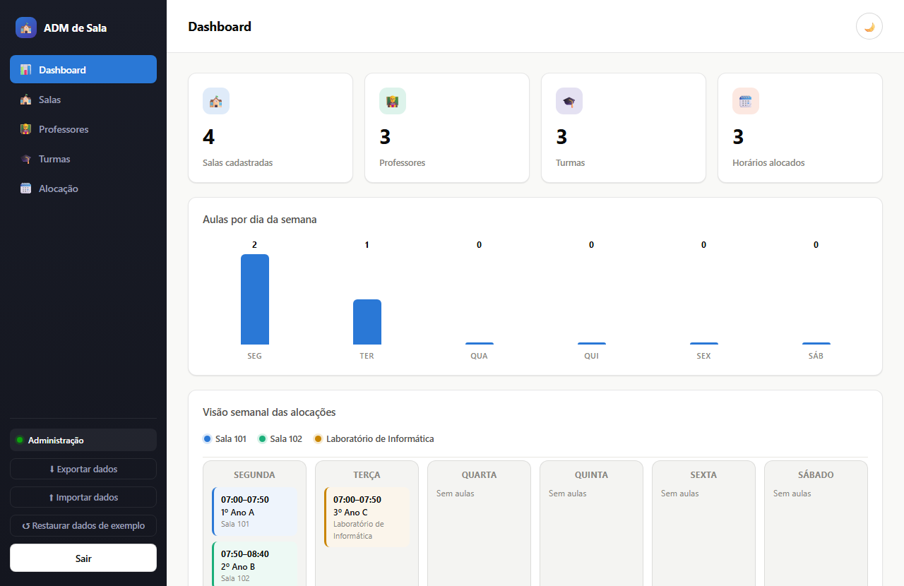
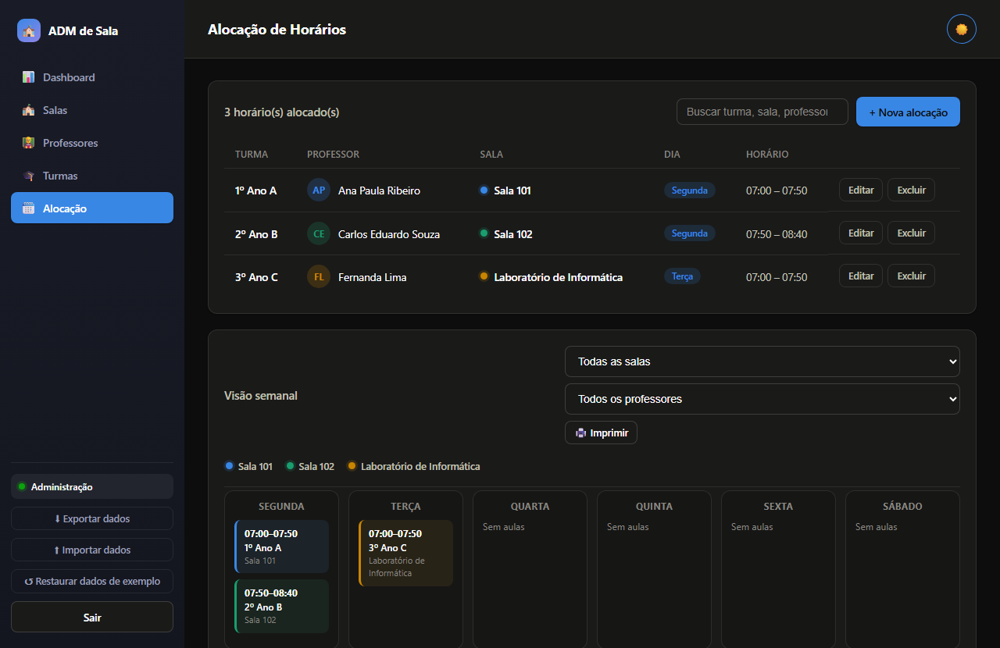

# ADM de Sala

Protótipo de sistema de gestão de salas, turmas e horários escolares, com **prevenção automática de conflitos de agenda**. Roda inteiramente no navegador — sem backend, sem instalação, sem build.



## O problema que resolve

Duas turmas na mesma sala no mesmo horário, ou um professor escalado em duas turmas ao mesmo tempo — erros comuns em controle manual (planilha, papel) que só aparecem quando já é tarde. O sistema bloqueia a alocação automaticamente se detectar conflito de **sala** ou de **professor**, antes de qualquer coisa ser gravada.



## Como rodar

Não há build nem dependências. Basta abrir `projeto/index.html` no navegador, ou servir a pasta com um servidor estático simples:

```
cd projeto
python -m http.server 8000
```

## Acesso

| Perfil | Senha | O que pode fazer |
|---|---|---|
| Administração | `123` | Acesso completo — cadastra salas, professores, turmas e gerencia todos os horários |
| Pedagógico | `456` | Visualiza tudo e gerencia horários, mas **não cria turmas** |

## Funcionalidades

- Alocação sem conflito (verifica sala e professor automaticamente)
- Alocação em vários dias da semana de uma vez
- Horários fixos por período (1º ao 8º) ou personalizado
- Aviso quando a turma excede a capacidade da sala
- Busca e filtros em todas as listas e na grade semanal
- Grade semanal com cor por sala, filtrável por sala/professor
- Impressão da grade semanal
- Exportar/importar dados em `.json`
- Restaurar dados de exemplo com um clique
- Modo claro/escuro
- Sidebar responsiva (vira menu retrátil em telas estreitas)

## Tecnologia

HTML, CSS e JavaScript puro — sem framework, sem backend. Dados salvos no `localStorage` do navegador. Código organizado em módulos (um arquivo por responsabilidade) em `projeto/js/` e `projeto/css/`.

Detalhes de arquitetura para quem for mexer no código: veja [CLAUDE.md](CLAUDE.md).
